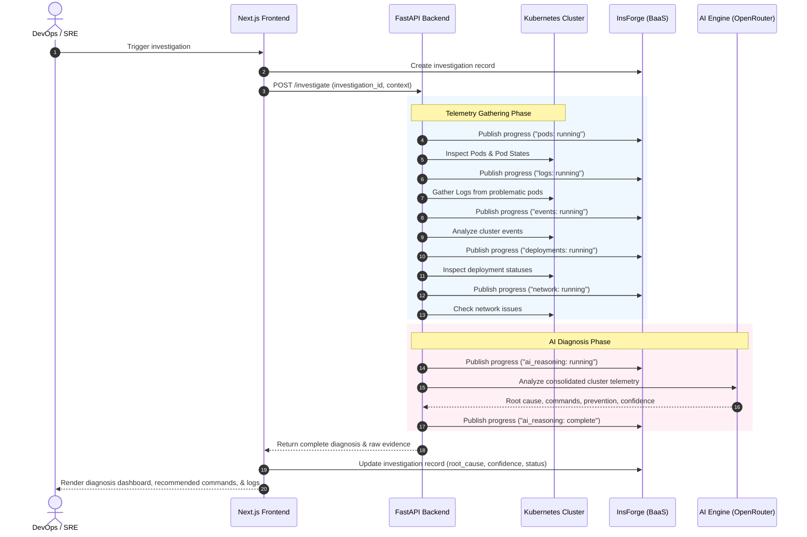

# 🛠️ AI Kubernetes Troubleshooting Agent

An AI-powered, real-time SRE (Site Reliability Engineering) assistant designed to inspect, diagnose, and recommend resolutions for Kubernetes cluster issues. By orchestrating telemetry collection across pods, logs, events, deployments, and network layers, the agent automatically compiles a detailed context profile, runs it through an LLM reasoning engine, and delivers root-cause diagnostics, confidence scores, and executable remediation commands.

Built on top of a modern **Next.js** frontend, a **FastAPI** backend, and powered by **InsForge** for authentication, database persistence, and real-time event streaming.

---

## 🚀 Key Features

- **Automated Cluster Telemetry Collection**: Runs multi-stage inspections on:
  - **Pods**: Detects common states like `CrashLoopBackOff`, `ImagePullBackOff`, `Pending`, or `Failed`.
  - **Logs**: Automatically fetches logs and crash traces from problematic pods.
  - **Events**: Analyzes recent cluster events (scheduling failures, liveness/readiness probe failures).
  - **Deployments**: Pinpoints replica mismatches, failing rollouts, and missing configurations.
  - **Network**: Evaluates service endpoints, DNS, and ingress connectivity issues.
- **Real-Time Progress Streaming**: Uses **InsForge Realtime** channels to stream each step of the telemetry gathering and AI diagnosis process directly to the user dashboard.
- **LLM Reasoning & Root Cause Diagnosis**: Integrates with LLM clients (via OpenRouter) to evaluate cluster state and isolate the exact root cause of issues.
- **Actionable Remediation**: Recommends the exact `kubectl` recovery commands and long-term prevention guidelines.
- **Multi-Context Cluster Management**: Supports inspecting different clusters by dynamically switching Kubernetes contexts.
- **Secure Authentication & Audit History**: Out-of-the-box user registration, sign-in, and personal investigation history persisted in a secure PostgreSQL database with Row-Level Security (RLS) policies.

---

## 🏗️ Architecture & Flow

The agent orchestrates telemetry gathering, real-time feedback, and AI-driven analysis in a structured pipeline:



---

## 🛠️ Technology Stack

* **Frontend**: [Next.js 15](https://nextjs.org/) (App Router), [React 19](https://react.dev/), TypeScript, [Tailwind CSS](https://tailwindcss.com/), [TanStack React Query v5](https://tanstack.com/query/latest)
* **Backend**: [FastAPI](https://fastapi.tiangolo.com/) (Python 3.10+), [Uvicorn](https://www.uvicorn.org/), [Pydantic v2](https://docs.pydantic.dev/), [Loguru](https://github.com/Delgan/loguru)
* **BaaS Platform**: [InsForge](https://insforge.dev/) (Postgres DB, Auth, Row-Level Security, and Realtime channels)
* **Kubernetes Integration**: Direct shell execution wrapping `kubectl` for real-time cluster interactions.

---

## 📂 Project Structure

```text
├── backend/                  # Python FastAPI application
│   ├── ai/                   # AI logic, prompt builders, LLM clients, and confidence scoring
│   ├── api/                  # FastAPI routing (health check, investigation endpoints)
│   ├── core/                 # App configuration & logging setup
│   ├── kubernetes/           # Kubectl wrappers for pods, logs, events, deployments, network
│   ├── models/               # Pydantic schema declarations
│   ├── services/             # Telemetry orchestration & realtime progress publishing
│   ├── main.py               # Application entry point
│   ├── Dockerfile            # Container build file
│   └── requirements.txt      # Python dependencies
│
├── frontend/                 # Next.js web application
│   ├── src/
│   │   ├── app/              # Next.js app pages (landing page, auth, dashboard)
│   │   ├── components/       # UI Components (Dashboard, DiagnosisCard, InvestigationHistory, progress tracking)
│   │   ├── hooks/            # Custom React hooks (realtime listeners, auth)
│   │   ├── lib/              # InsForge client configuration & helper libraries
│   │   ├── services/         # API clients for backend communication
│   │   └── types/            # TypeScript interface definitions
│   ├── Dockerfile            # Container build file
│   └── package.json          # Node.js dependencies
│
├── docs/                     # Database setup scripts & static documentation
│   └── insforge-setup.sql    # PostgreSQL schema setup, RLS, and realtime channels
│
├── prompts/                  # Text prompt templates for LLM tuning
└── docker-compose.yml        # Orchestrates backend & frontend development servers
```

---

## ⚙️ Local Development Setup

### Prerequisites
1. **kubectl CLI**: Installed and configured to interact with a target Kubernetes cluster (`kubectl get nodes` must work).
2. **Docker & Docker Compose**: Recommended for local multi-service container running.
3. **OpenRouter API Key**: An active API key with access to LLM models (e.g. `openai/gpt-4o-mini` or similar).
4. **InsForge Account**: Base URL and Anon Key for database and realtime services.

---

### Step 1: Environment Setup

#### Backend configuration
Create `backend/.env` using the provided template:
```bash
cp backend/.env.example backend/.env
```
Fill out the variables:
- `OPENROUTER_API_KEY`: Your OpenRouter api key.
- `OPENROUTER_MODEL`: LLM Model identifier (Default: `openai/gpt-4o-mini`).
- `INSFORGE_BASE_URL`: Your InsForge API base.
- `INSFORGE_ANON_KEY`: Your InsForge Anon public key.
- `KUBECONFIG_PATH`: Path to your Kubernetes config file (defaults to `~/.kube/config` if left blank).

#### Frontend configuration
Create `frontend/.env` using the template:
```bash
cp frontend/.env.example frontend/.env
```
Fill out the variables:
- `NEXT_PUBLIC_API_BASE_URL`: URL where the Python backend runs (Default: `http://localhost:8000`).
- `NEXT_PUBLIC_INSFORGE_BASE_URL`: Your InsForge API base.
- `NEXT_PUBLIC_INSFORGE_ANON_KEY`: Your InsForge Anon public key.

---

### Step 2: Database & Realtime Setup
Run the SQL queries in `docs/insforge-setup.sql` within your InsForge project SQL editor. This sets up:
1. The `investigations` table.
2. Row-Level Security (RLS) policies mapping to `auth.uid()`.
3. The realtime channels subscription configuration for streaming progress updates.

---

### Step 3: Run the Application

You can spin up the entire application using Docker Compose or manually on your machine.

#### Option A: Run via Docker Compose (Recommended)
Launch both services simultaneously:
```bash
docker-compose up --build
```
- Frontend will be accessible at: `http://localhost:3000`
- Backend API will run at: `http://localhost:8000`

#### Option B: Run Services Manually

##### 1. Start the Backend
Navigate to the `backend` directory, create a virtual environment, install dependencies, and run:
```bash
cd backend
python -m venv venv
# On Windows:
.\venv\Scripts\activate
# On Linux/macOS:
source venv/bin/activate

pip install -r requirements.txt
uvicorn main:app --host 0.0.0.0 --port 8000 --reload
```

##### 2. Start the Frontend
Navigate to the `frontend` directory, install dependencies, and start the development server:
```bash
cd frontend
npm install
npm run dev
```

---

## 🔒 Security & Row-Level Policy
Row-Level Security (RLS) is fully configured for user privacy. Users can only view or insert investigations that are linked to their own account credentials:
```sql
CREATE POLICY "Users can view own investigations"
ON public.investigations FOR SELECT
TO authenticated
USING (user_id = auth.uid()::text);
```

---

## 📜 License
This project is licensed under the MIT License.
